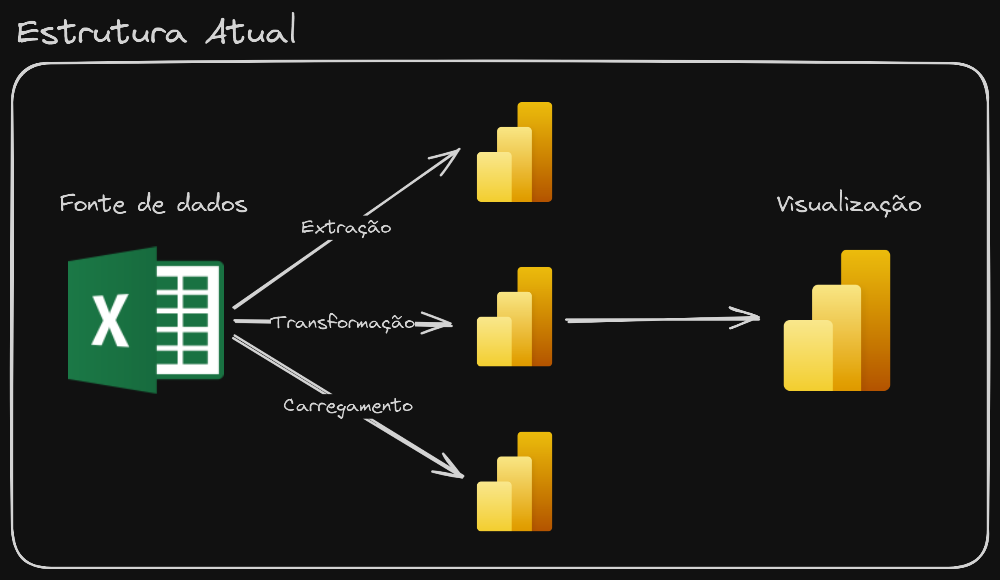
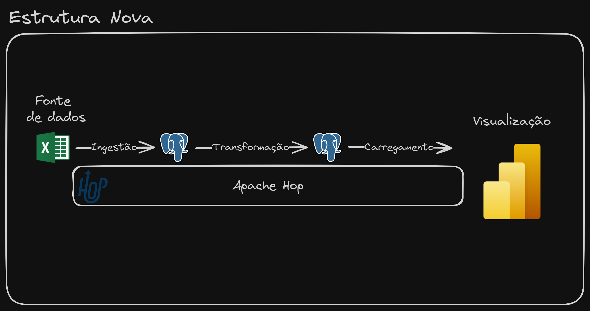
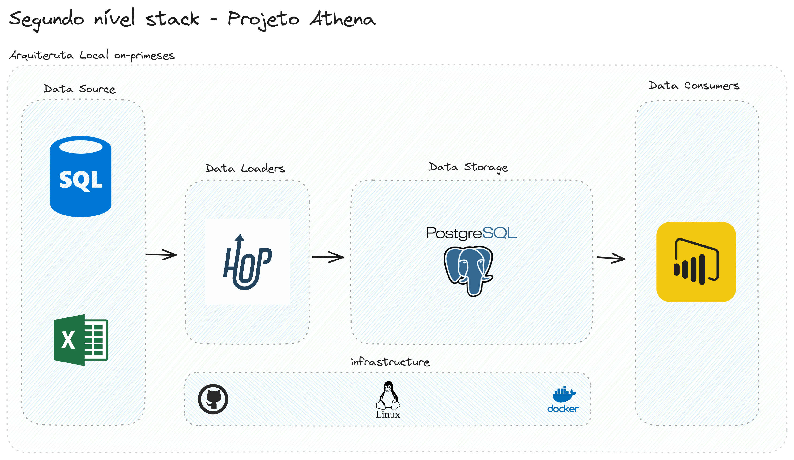
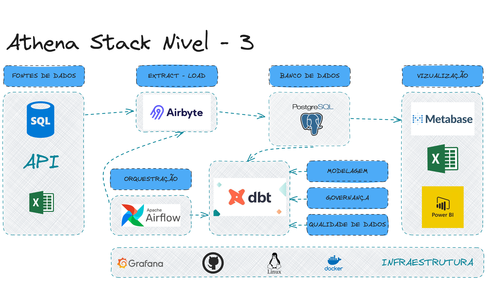

# Projeto Athena - Evolução de uma Stack de Dados 🧙‍♂️

## Menu

- [Stack Inicial](#stack-inicial)
- [Stack de Dados Evoluída - Nivel 1](#stack-de-dados-evoluída---nivel-1)
- [Aulas do Projeto Athena | N1 | YouTube](#aulas-do-projeto-athena--n1--youtube)
- [Arquivos - Nível 1](#arquivos---nível-1)
- [Stack de Dados Evoluída - Nivel 2](#stack-de-dados-evoluída---nivel-2)
- [Aulas do Projeto Athena | N2 | YouTube](#aulas-do-projeto-athena--n2--youtube)
- [Stack de Dados Evoluída - Nivel 3](#stack-de-dados-evoluída---nivel-3)
- [Aulas do Projeto Athena | N3 | YouTube](#aulas-do-projeto-athena--n3--youtube)

## Ciclo de vida da Engenharia de Dados

| Elemento                 | Descrição                                                                                      |
|--------------------------|------------------------------------------------------------------------------------------------|
| **Segurança**            | Controle de acesso para dados Sistemas                                                      |
| **Gerenciamento de dados** | Governança de dados Capacidade de dados Accountability Modelagem de dados Integridade dos dados |
| **DataOps**              | Governança de dados Observabilidade e monitoramento Relatórios de incidentes              |
| **Arquitetura de dados** | Análise de dados Desenvolvimento Plataforma de dados Gerar valor para dados           |
| **Orquestração**         | Coordenar fluxos de trabalho Programação Executar tarefas                                 |
| **Engenharia de software** | Habilidades de programar Prototipação Gestão de código Teste e recuperação             |

## Stack Inicial

### Introdução

O projeto Athena é um projeto de evolução de uma stack de dados. A stack de dados é um conjunto de ferramentas e tecnologias que são utilizadas para a ingestão, armazenamento, processamento e visualização de dados. A stack de dados inicial será baseada na que muitas empresas usam no seu dia a dia e a mesma que muitos profissionais de dados aprendem a utilizar. A stack de dados inicial é composta por:

- Excel como origem de dados;
- Power Query como ferramenta de ingestão de dados;
- Power Query como ferramenta de transformação de dados;
- Power Query como ferramenta de carga de dados;
- Power BI como ferramenta de visualização de dados.

  

### Desvantagens

Apesar dessa ser na maioria das vezes a stack de dados inicial de muitas empresas e analistas de dados, ela possui algumas desvantagens:

- **Excel como origem de dados**: O Excel é uma ferramenta muito poderosa e versátil, mas não é a melhor ferramenta para armazenar dados. O Excel não é um banco de dados e não foi feito para armazenar grandes volumes de dados. Além disso, o Excel não é uma ferramenta colaborativa, o que dificulta o compartilhamento de dados entre os membros da equipe.

- **Power Query como ferramenta de ingestão de dados**: O Power Query é uma ferramenta muito poderosa e versátil, mas não é a melhor ferramenta para a ingestão de dados. O Power Query não foi feito para lidar com grandes volumes de dados e não é uma ferramenta colaborativa.

- **Power Query como ferramenta de transformação de dados**: Apesar de ter bastante poder de transformação de dados e ser fácil de usar, o Power Query não é a melhor ferramenta para a transformação de dados. O mesmo não foi feito para lidar com grandes volumes de dados além de não possuir versionamento de código, deixar todo o processo na ferramenta e não permitir a reutilização de código. Tudo isso gera uma divida técnica muito grande, para o time de dados.

- **Power Query como ferramenta de carga de dados**: O Power Query não é a melhor ferramenta para a carga de dados.

- **Power BI como ferramenta de visualização de dados**: O Power BI é uma ferramenta muito poderosa e versátil para a visualização de dados, e é ai que ele deve ser utilizado.

## Stack de Dados Evoluída - Nivel 1
[Topo ⤴︎](#menu)

A stack de dados evoluída é composta por:

- Excel como origem de dados;
- Apache Hop como ferramenta de ingestão de dados;
- PostgreSQL como banco de dados (Data Warehouse);
- Apache Hop como ferramenta de transformação de dados;
- Apache Hop como ferramenta de carga de dados;
- Power BI como ferramenta de visualização de dados.

  

### Vantagens

A stack de dados evoluída possui várias vantagens em relação a stack de dados inicial:

- **Excel como origem de dados**: O Excel é uma ferramenta muito poderosa e versátil, e é muito utilizada como origem de dados. A stack de dados evoluída mantém o Excel como origem de dados, mas utiliza o Apache Hop para fazer a ingestão dos dados.

- **Apache Hop como ferramenta de ingestão de dados**: O Apache Hop é uma ferramenta muito poderosa e versátil para a ingestão de dados. O Apache Hop foi feito para lidar com grandes volumes de dados e é uma ferramenta colaborativa.

- **PostgreSQL como banco de dados (Data Warehouse)**: O PostgreSQL é um banco de dados muito poderoso e versátil, e é muito utilizado como Data Warehouse. O PostgreSQL foi feito para lidar com grandes volumes de dados e é uma ferramenta colaborativa.

- **Apache Hop como ferramenta de transformação de dados**: O Apache Hop é uma ferramenta muito poderosa e versátil para a transformação de dados. O Apache Hop foi feito para lidar com grandes volumes de dados e possui versionamento de código, permitindo a reutilização de código.

- **Apache Hop como ferramenta de carga de dados**: O Apache Hop é uma ferramenta muito poderosa e versátil para a carga de dados.

- **Power BI como ferramenta de visualização de dados**: O Power BI é uma ferramenta muito poderosa e versátil para a visualização de dados, e é ai que ele deve ser utilizado.

### Aulas do Projeto Athena | N1 | YouTube
[Topo ⤴︎](#menu)

- [Projeto Athena - Aula 01 - Introdução](https://youtu.be/d9yKAGrFB10)
- [Projeto Athena - Aula 02 - Instalação](https://youtu.be/2lVmmqdGxNU)
- [Projeto Athena - Aula 03 - Extração - Conceito](https://youtu.be/d_slBFnIJKw)
- [Projeto Athena - Aula 04 - Extração - Hands On](https://youtu.be/SGiIFvzNEvU)
- [Projeto Athena - Aula 05 - Staging - Hands On](https://youtu.be/Wll9ssdWLAA)
- [Projeto Athena - Aula 06 - Marts - Conceito](https://youtu.be/VKei-c16f0Y)
- [Projeto Athena - Aula 07 - Marts - Hands On](https://youtu.be/ln4Yx_XMjZc)
- [Projeto Athena - Aula 08 - Finalização](https://youtu.be/_7cb6J5ERvM)

### Arquivos - Nível 1

[baixar](https://mega.nz/file/wUdFDZbC#DH4JwgEpiLU_ohbJh2vrkkQL6E4deaVZciPa8PJiuns)

### Conclusão - Nível 1

A stack de dados evoluída é muito mais robusta e poderosa do que a inicial, capaz de processar maiores volumes de dados de forma eficiente e colaborativa.

Não mudamos só as ferramentas, mas também a forma de pensar e trabalhar com dados. A stack de dados evoluída é baseada em conceitos de DataOps e Data Engineering, que são fundamentais para a construção de pipelines de dados eficientes e escaláveis.

Porém como mencionamos essa não é a stack definitiva, ela é apenas o primeiro passo de uma longa jornada de evolução de dados. Por conta disso temos algumas oportunidades de melhoria que serão abordadas nas próximas evoluções:

- 🗒️ **Excel como origem de dados**: Apesar de termos criado validações, ainda é possível que os usuários do Excel façam alterações indevidas nos dados. O que torna o processo de ingestão de dados vulnerável a erros. A melhor abordagem seria a substituição do Excel por um banco de dados relacional, uma API ou um sistema de mensageria.

- **🦺 Modelagem de dados no Apache Hop**: Apesar de termos criado um Data Warehouse no PostgreSQL, a modelagem de dados no Apache Hop ainda é um ponto de atenção, pois estamos usando códigos SQL dentro da ferramenta, o que causa transtornos na hora da manutenção, versionamento e reutilização de código. A melhor abordagem seria a utilização de ferramentas de modelagem de dados como o dbt.

- **🔒 Segurança dos dados**: A segurança dos dados é um ponto crítico em qualquer stack de dados. A stack de dados evoluída não possui nenhum mecanismo de segurança dos dados, o que pode ser um problema em ambientes de produção. A melhor abordagem seria a implementação de mecanismos de segurança dos dados como criptografia, controle de acesso e auditoria.

- **📊 Monitoramento e alertas**: O monitoramento e alertas são fundamentais para garantir a integridade e disponibilidade dos dados. A stack de dados evoluída não possui nenhum mecanismo de monitoramento e alertas. A melhor abordagem seria a implementação de mecanismos de monitoramento e alertas como dashboards, alertas por e-mail e integração com ferramentas de monitoramento.

- **🎼 Orquestração de pipelines de dados**: A orquestração de pipelines de dados é fundamental para garantir a execução dos pipelines de forma eficiente e escalável. A stack de dados evoluída não possui nenhum mecanismo de orquestração de pipelines de dados. A melhor abordagem seria a implementação de mecanismos de orquestração de pipelines de dados como Apache Airflow ou Prefect.

- **🖥️ Ambiente local**: A stack de dados evoluída foi construída em um ambiente local, o que pode tornar o ambiente instável, pois todas as etapas vão depender do poder de processamento da maquina local. A melhor abordagem seria a implementação da stack de dados em um ambiente de nuvem como AWS, GCP ou Azure.

- **🫅 Governança de dados**: A governança de dados é fundamental para garantir a qualidade e integridade dos dados. A stack de dados evoluída não possui nenhum mecanismo de governança de dados. A melhor abordagem seria a implementação de mecanismos de governança de dados como catálogo de dados, glossário de dados e políticas de dados.

- **⌨️ Testes automatizados**: Os testes automatizados são fundamentais para garantir a qualidade e integridade dos dados. A stack de dados evoluída não possui nenhum mecanismo de testes automatizados. A melhor abordagem seria a implementação de mecanismos de testes automatizados como testes de integração, testes de unidade e testes de regressão.

- **👩‍🏫 Documentação dos processos**: A documentação dos processos é fundamental para garantir a qualidade e integridade dos dados. A stack de dados evoluída não possui nenhum mecanismo de documentação dos processos. A melhor abordagem seria a implementação de mecanismos de documentação dos processos como documentação de código, documentação de pipelines e documentação de datasets.

A perfeição é inatingível, mas a melhoria é infinita. A stack de dados evoluída é um grande avanço em relação a stack de dados inicial, mas ainda há muito a ser feito para torná-la ainda mais robusta e poderosa. A stack de dados evoluída é apenas o primeiro passo de uma longa jornada de evolução de dados, e estamos apenas começando, aguardem os próximos níveis.

## Stack de Dados Evoluída - Nivel 2
[Topo ⤴︎](#menu)

A stack de dados evoluída nível 2 é composta pelas seguintes melhorias:

- Banco de dados relacional como origem de dados;
- GitHub integrado com Apache Hop;
- Data Warehouse rodando no Linux (Docker);
- Data Warehouse aberto a conexões externas;
- Níveis de acesso no DW PostgreSQL;
- Pipelines do Apache Hop Orquestrados;

  

### Vantagens

A stack de dados evoluída nível 2 possui várias vantagens em relação a stack nível 1:

- **Banco de dados relacional como origem de dados**: O banco de dados relacional é uma fonte de dados mais robusta e segura do que o Excel. O banco de dados relacional possui mecanismos de segurança e integridade dos dados que o Excel não possui.

- **GitHub integrado com Apache Hop**: O GitHub é uma ferramenta muito poderosa e versátil para o versionamento de código. O GitHub permite o controle de versão do código, o que facilita a colaboração entre os membros da equipe.

- **Data Warehouse rodando no Linux (Docker)**: O Data Warehouse rodando no Linux (Docker) é mais estável e seguro do que o Data Warehouse rodando no Windows. O Linux é um sistema operacional mais robusto e seguro, e o Docker é uma ferramenta muito poderosa e versátil para a execução de containers.

- **Data Warehouse aberto a conexões externas**: O Data Warehouse aberto a conexões externas permite que outras ferramentas e sistemas se conectem ao Data Warehouse. O Data Warehouse aberto a conexões externas facilita a integração automática Power BI, Tableau, Metabase, etc.

- **Níveis de acesso no DW PostgreSQL**: Os níveis de acesso no Data Warehouse PostgreSQL permitem controlar quem pode acessar e modificar os dados. Os níveis de acesso garantem a segurança e integridade dos dados.

- **Pipelines do Apache Hop orquestrados**: Os pipelines do Apache Hop orquestrados garantem a execução dos pipelines de forma eficiente e escalável. Os pipelines orquestrados permitem a execução dos pipelines em paralelo e em sequência, tornando as cargas automáticas e escaláveis.

### Aulas do Projeto Athena | N2 | YouTube
[Topo ⤴︎](#menu)

- [Projeto Athena - Aula 01 - Introdução](https://youtu.be/GV0RuKpsrz4)
- [Projeto Athena - Aula 02 - GIT - Conceito](https://youtu.be/uQGesECRz4k)
- [Projeto Athena - Aula 03 - GIT - Hands On](https://youtu.be/SeYgS_TdUm8)
- [Projeto Athena - Aula 04 - Linux - Conceito](https://youtu.be/FTtCw71mqug)
- [Projeto Athena - Aula 05 - Docker - Conceito](https://youtu.be/7Z9Z9Z9Z9Z9)
- [Projeto Athena - Aula 06 - Mudança DW - Hands On](https://youtu.be/c-fWxciQTEY)
- [Projeto Athena - Aula 07 - Mudança ETL - Hands On](https://youtu.be/ZuzIGuu911Y)
- [Projeto Athena - Aula 08 - Finalização](https://youtu.be/wZHAdewwsSs)

### Conclusão - Nível 2

A stack de dados evoluída nível 2 é um grande avanço em relação a stack de dados evoluída nível 1, capaz de processar maiores volumes de dados de forma eficiente e colaborativa.

Porém como mencionamos essa não é a stack definitiva, ela é apenas o segundo passo de uma longa jornada de evolução de dados. Por conta disso temos algumas oportunidades de melhoria que serão abordadas nas próximas evoluções:

- 🗒️ **Banco de dados relacional como origem de dados**: Apesar de termos substituído o Excel por um banco de dados relacional, utilizamos um banco que subimos dentro do próprio ambiente. Vamos melhorar isso no futuro buscando de uma API.

- **🦺 Modelagem de dados no Apache Hop**: Apesar de termos criado um Data Warehouse no PostgreSQL, a modelagem de dados no Apache Hop ainda é um ponto de atenção, pois estamos usando códigos SQL dentro da ferramenta, o que causa transtornos na hora da manutenção, versionamento e reutilização de código. A melhor abordagem seria a utilização de ferramentas de modelagem de dados como o dbt.

- **🔒 Segurança dos dados**: A segurança dos dados é um ponto crítico em qualquer stack de dados. A stack de dados evoluída nível 2 possui apenas um mecanismo de segurança dos dados, o que pode ser um problema em ambientes de produção. A melhor abordagem seria a implementação de mecanismos de segurança dos dados como criptografia, controle de acesso e auditoria.

- **📊 Monitoramento e alertas**: O monitoramento e alertas são fundamentais para garantir a integridade e disponibilidade dos dados. A stack de dados evoluída nível 2 não possui nenhum mecanismo de monitoramento e alertas. A melhor abordagem seria a implementação de mecanismos de monitoramento e alertas como dashboards, alertas por e-mail e integração com ferramentas de monitoramento.

- **🖥️ Ambiente local**: A stack de dados evoluída nível 2 foi construída em um ambiente local, o que pode tornar o ambiente instável, pois todas as etapas vão depender do poder de processamento da maquina local. A melhor abordagem seria a implementação da stack de dados em um ambiente de nuvem como AWS, GCP ou Azure.

- **🫅 Governança de dados**: A governança de dados é fundamental para garantir a qualidade e integridade dos dados. A stack de dados evoluída nível 2 não possui nenhum mecanismo de governança de dados. A melhor abordagem seria a implementação de mecanismos de governança de dados como catálogo de dados, glossário de dados e políticas de dados.

- **⌨️ Testes automatizados**: Os testes automatizados são fundamentais para garantir a qualidade e integridade dos dados. A stack de dados evoluída nível 2 não possui nenhum mecanismo de testes automatizados. A melhor abordagem seria a implementação de mecanismos de testes automatizados como testes de integração, testes de unidade e testes de regressão.

- **👩‍🏫 Documentação dos processos**: A documentação dos processos é fundamental para garantir a qualidade e integridade dos dados. A stack de dados evoluída nível 2 não possui nenhum mecanismo de documentação dos processos. A melhor abordagem seria a implementação de mecanismos de documentação dos processos como documentação de código, documentação de pipelines e documentação de datasets.

A perfeição é inatingível, mas a melhoria é infinita. A stack de dados evoluída nível 2 é um grande avanço em relação a stack de dados evoluída nível 1, mas ainda há muito a ser feito para torná-la ainda mais robusta e poderosa. A stack de dados evoluída nível 2 é apenas o segundo passo de uma longa jornada de evolução de dados, e estamos apenas começando, aguardem os próximos níveis.

## Stack de Dados Evoluída - Nivel 3
[Topo ⤴︎](#menu)

A stack de dados evoluída nível 3 é composta pelas seguintes melhorias:

- API como origem de dados;
- Airbyte para ingestão de dados;
- Apache Airflow para orquestração de pipelines;
- DBT para modelagem de dados;
- DBT para governança de dados;
- DBT para documentação de processos;
- DBT para testes automatizados;
- DBT qualidade de dados;
- Postgres como Data Warehouse;
- Metabase para visualização de dados;
- Grafana para monitoramento de Infraestrutura;
- Prometheus para monitoramento de Aplicações;
- Cadvisor para monitoramento de Containers;
- Docker para orquestração de containers;
- Linux como sistema operacional;
- GIT para versionamento de código;
- Shell Script para automação de tarefas;

  

### Bônus

Desenvolvimento de um projeto de dados completo, com todas as ferramentas e tecnologias da stack de dados evoluída nível 3.

### Vantagens

A stack de dados evoluída nível 3 oferece diversas vantagens em comparação à stack nível 2, com ferramentas especializadas que aprimoram cada aspecto do processamento de dados:

**API como origem de dados**: A API (Application Programming Interface) é utilizada como fonte de dados, oferecendo `robustez` e `segurança` superior aos bancos de dados relacionais tradicionais. APIs permitem a `integração` com sistemas externos, facilitam o acesso controlado aos dados e garantem a `integridade` das transações através de `autenticação`, `autorização` e `mecanismos de criptografia`.

**Airbyte para ingestão de dados**: O Airbyte é uma ferramenta `open-source` projetada para a ingestão de grandes volumes de dados de `diversas fontes`. Ele oferece conectores `pré-construídos` para várias origens de dados, permite a configuração de pipelines de dados de maneira `colaborativa` e suporta funcionalidades como `replicação incremental`, transformação de dados e `monitoramento contínuo dos fluxos de ingestão`.

**Apache Airflow para orquestração de pipelines**: O Apache Airflow é uma plataforma poderosa para a `orquestração` de workflows complexos de dados. Ele permite a definição, `agendamento` e `monitoramento` de pipelines de dados através de `DAGs` (Directed Acyclic Graphs), facilitando o gerenciamento de dependências entre tarefas, a `escalabilidade` e o monitoramento em tempo real com `alertas` configuráveis.

**DBT (Data Build Tool) para modelagem, governança e qualidade de dados**: O DBT é uma ferramenta central na stack nível 3, abrangendo várias funções críticas:

  - Modelagem de dados: Facilita a transformação de dados utilizando `SQL`, promovendo a `reutilização` e `versionamento` de código, além de gerar `documentação` automática e visível através de uma interface web.

  - Governança de dados: Oferece recursos como `catálogo de dados e glossário`, ajudando na definição de políticas de dados e na organização de ativos de dados de maneira estruturada.

  - Qualidade de dados: Implementa `testes automatizados` para validação, limpeza e enriquecimento de dados, garantindo a `precisão e confiabilidade dos datasets`.

**Postgres como Data Warehouse**: O PostgreSQL é utilizado como um banco de dados Data Warehouse devido à sua `robustez` e capacidade de lidar com grandes volumes de dados. Ele oferece suporte a transações `ACID`, índices avançados, replicação e ferramentas de backup, além de extensões que melhoram seu desempenho para cargas de trabalho analíticas.

**Metabase para visualização de dados**: O Metabase é uma ferramenta de BI (Business Intelligence) que permite a criação de `dashboards interativos`, gráficos e relatórios. Ele suporta consultas `SQL`, visualização de dados em `tempo real` e colaboração entre usuários através de compartilhamento de painéis.

**Grafana para monitoramento de infraestrutura**: O Grafana é uma plataforma `open-source` que oferece visualização e análise de `métricas de infraestrutura`. Ele integra-se com diversas fontes de dados, permitindo a criação de dashboards personalizados e `alertas` para monitoramento proativo da `saúde da infraestrutura`.

**Prometheus para monitoramento de aplicações**: O Prometheus é uma ferramenta de monitoramento e alerta de código aberto focada em aplicações. Ele coleta e armazena métricas em `séries temporais`, suporta consultas avançadas com `PromQL (Prometheus Query Language)` e integra-se nativamente com Grafana para visualização.

**Cadvisor para monitoramento de containers**: O Cadvisor (Container Advisor) monitora o uso de recursos `(CPU, memória, rede e I/O)` dos containers em `tempo real`, fornecendo métricas detalhadas que ajudam na otimização e gerenciamento de ambientes `containerizados`.

**Docker para gerenciamento de containers**: O Docker permite a criação, implantação e gerenciamento de containers de forma `eficiente`. Ele isola aplicações em ambientes separados, facilita a `escalabilidade horizontal` e integra-se com ferramentas de `CI/CD` e monitoramento para automação completa do ciclo de vida das aplicações.

**Linux como sistema operacional**: O Linux é amplamente utilizado devido à sua `estabilidade`, `segurança` e `flexibilidade`. Ele oferece suporte a scripts de automação, ferramentas de gerenciamento de pacotes e um ecossistema robusto de `software livre`, essencial para a execução `confiável` de pipelines de dados.

**GIT para versionamento de código**: O GIT é uma ferramenta de controle de versão `distribuída` que facilita o rastreamento de mudanças no código, `colaboração entre desenvolvedores` e manutenção de um histórico completo de alterações, essencial para projetos de dados `complexos`.

**Shell Script para automação de tarefas**: Shell Scripts são utilizados para automatizar tarefas `repetitivas` e complexas, integrando diversos processos e ferramentas. Eles são altamente `eficientes` para a execução de scripts de manutenção, backups, deploys e outras operações administrativas, suportando a `escalabilidade` e a `integração` com sistemas de monitoramento.

Essa stack nível 3, composta por ferramentas especializadas, proporciona uma infraestrutura de dados robusta, segura e eficiente, capaz de lidar com grandes volumes de dados e complexidades operacionais, garantindo alto desempenho e confiabilidade em todas as etapas do pipeline de dados.

### Aulas do Projeto Athena | N3 | YouTube
[Topo ⤴︎](#menu)

- [Projeto Athena - Aula 01 - Introdução](https://youtu.be/2neuQg14VTA)
- [Projeto Athena - Aula 02 - ETL x ELT - Conceito](https://youtu.be/D-7u0iog5QE)
- [Projeto Athena - Aula 03 - Formas de Subir Containers - DockerFile - DockerCompose - Conceito](https://youtu.be/TheuhCxI6Xc)
- [Projeto Athena - Aula 04 - DW Postgres - Para PROD](https://youtu.be/) - Em breve

### Obrigado por apreciar o material, ajudem compartilhando e disseminando esse conhecimento. 

Selo:

