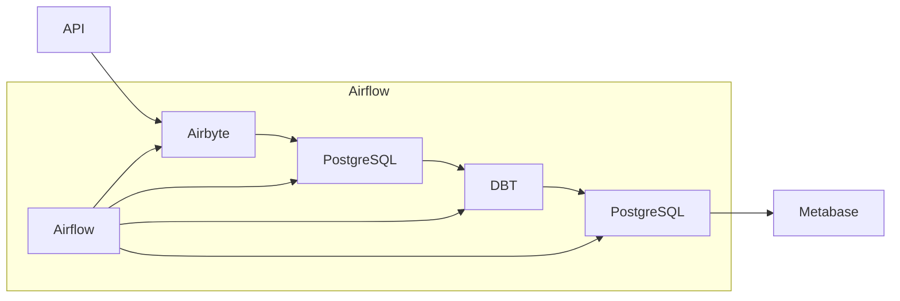

# Painel de Monitoramento de Criptomoedas

Este projeto cria um pipeline de dados para monitoramento e análise de preços de criptomoedas, utilizando a API pública do `CoinGecko`. 

Os dados são `coletados`, `transformados`, `armazenados` e `visualizados` em um painel de Business Intelligence (BI).

## Arquitetura do Projeto



## Tecnologias Utilizadas

- `Airbyte`: Para integração e extração de dados da API CoinGecko.

- `Airflow`: Para orquestração de ELT (Extract, Load, Transform).

- `PostgreSQL`: Será nosso DW (Data Warehouse) para armazenamento e modelagem de dados.

- `DBT (Data Build Tool)`: Nossa ferramenta de modelagem, ela também vai zelar pela qualidade dos dados.

- `Metabase`: Será nossa dataviz, onde vamos criar painéis para visualização dos dados.

- `Grafana`: Para monitoramento e visualização de métricas do ambiente.

## Estrutura do Projeto

- Coleta de Dados
    - Configurar Airbyte para integração com a API do CoinGecko.
    - Configurar Airbyte para enviar dados coletados para o PostgreSQL.

- Orquestração de Tarefas
    - Configurar Airflow para agendamento e execução de tarefas ELT.

- Armazenamento de Dados
    - Configurar PostgreSQL para armazenamento de dados brutos e transformados.

- Transformação de Dados
    - Criar modelos DBT para transformação e limpeza de dados no PostgreSQL.

- Visualização de Dados
    - Criar painéis no Metabase para visualização dos dados.

- Monitoramento
    - Configurar Prometheus para coleta de métricas do sistema.
    - Configurar Grafana para visualização de métricas.

## Passo a Passo para Implementação

1. Já configuramos nosso ambiente de desenvolvimento pode ver completo [aqui](https://github.com/Linhares015/athena_stack_infra)

2. Configuração do Airbyte

    - Acesse a interface do Airbyte em http://localhost:8000.
    - Adicione uma nova conexão usando a API CoinGecko:
        - `Source`: HTTP API Source
        - `Destination`: PostgreSQL

    - Exemplo de Configuração da API CoinGecko:

        - URL: https://api.coingecko.com/api/v3/coins/markets?vs_currency=usd
        - Method: GET
        - Query Parameters:
        - vs_currency: usd
        - order: market_cap_desc
        - per_page: 100
        - page: 1
        - sparkline: false

    - Configurar Destino no Airbyte

    - Configure o PostgreSQL como destino:
        - Host: seu_host_postgres
        - Port: 5432
        - Database: airbyte
        - Username: seu_usuario
        - Password: sua_senha

3. Configuração do Airflow
    - Criar DAG no Airflow
    - Crie um arquivo DAG no Airflow para orquestrar as tarefas de ETL:
```python
from airflow import DAG
from airflow.operators.dummy_operator import DummyOperator
from airflow.operators.python_operator import PythonOperator
from datetime import datetime
from airbyte_api import AirbyteClient

default_args = {
    'owner': 'airflow',
    'start_date': datetime(2023, 1, 1),
    'retries': 1,
}

def run_airbyte_sync():
    client = AirbyteClient(
        airbyte_url='http://localhost:8000',
        airbyte_api_key='sua_chave_api'
    )
    client.trigger_sync(connection_id='sua_conexao_id')

with DAG('crypto_etl', default_args=default_args, schedule_interval='@hourly') as dag:
    start = DummyOperator(task_id='start')
    run_sync = PythonOperator(
        task_id='run_airbyte_sync',
        python_callable=run_airbyte_sync
    )
    end = DummyOperator(task_id='end')

    start >> run_sync >> end
```
4. Configuração do PostgreSQL
Configurar Esquemas e Tabelas
Conecte-se ao PostgreSQL e crie os esquemas e tabelas necessários para armazenar os dados brutos e transformados.

5. Desenvolvimento da Transformação de Dados no DBT.

6. Visualização de Dados no Metabase

    - Crie painéis para visualizar preços atuais, históricos e tendências de mercado.
    - Indicadores de Desempenho (KPIs) sugeridos:
    - Preço atual (current_price)
    - Capitalização de mercado (market_cap)
    - Volume total (total_volume)
    - Variação percentual de preço nas últimas 24h (price_change_percentage_24h)
    - Maior preço nas últimas 24h (high_24h)
    - Menor preço nas últimas 24h (low_24h)

7. Monitoramento com Prometheus e Grafana
Configurar Prometheus

## Considerações Finais

Este projeto demonstra habilidades em integração de dados, ETL, armazenamento e visualização em BI, utilizando uma infraestrutura completa com Airbyte, Airflow, PostgreSQL, DBT, Prometheus e Grafana.
